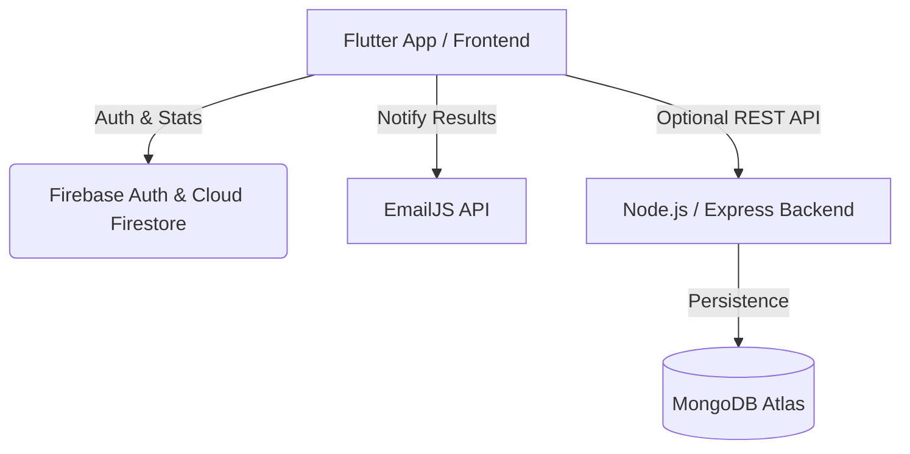

# 🥋 Karate Pro — Grading & Exam Management App

Karate Pro is a modern, responsive mobile and web application designed to manage belt grading exams for karate schools. It features a complete **Flutter Frontend** client and an **Express.js & MongoDB Backend** server, connected with **Firebase Authentication**, **Cloud Firestore**, and **EmailJS** notifications.

---

## 🌟 Key Features

### 👨‍👩‍👧 Parent Portal
* **Student Registration**: Register children for upcoming belt grading exams, specifying current belt status, notes, and contact details.
* **Results Dashboard**: Live tracking of exam scores (Kata, Kumite, Kihon) and the final passing status (**En attente**, **Reçu**, or **Recalé**).
* **Vibrant UI & Animations**: Smooth gradients, modern card designs, progress bars, and custom gauge visualizations for belt metrics.

### 🥋 Coach & Admin Dashboard
* **Exams Overview**: Real-time evaluation of all registered children.
* **Grading Interface**: Enter specific scores for **Kata**, **Kumite**, and **Kihon** techniques.
* **Automated Email Notifications**: Automatically dispatches rich HTML grading reports to parent emails upon submission via EmailJS.

---

## 🏗️ Project Architecture



### 📂 Directory & File Reference

* 📱 **Frontend (Flutter)**:
  * [main.dart](file:///c:/app%20bilelREAL/lib/main.dart): The main Flutter application containing the UI screens (Authentication, Parent Home, Inscriptions Tab, Results Tab, Coach Dashboard).
  * [firebase_options.dart](file:///c:/app%20bilelREAL/lib/firebase_options.dart): Firebase service configurations, with secret obfuscation applied to prevent scanner alerts.
* ⚙️ **Backend (Express)**:
  * [server.js](file:///c:/app%20bilelREAL/backend/server.js): The main Node.js API server utilizing Mongoose, Cors, and JWT authentication.
  * [package.json](file:///c:/app%20bilelREAL/backend/package.json): Node.js package manifests and dependencies.
  * [models/User.js](file:///c:/app%20bilelREAL/backend/models/User.js): Mongoose database schema for users.
  * [models/Inscription.js](file:///c:/app%20bilelREAL/backend/models/Inscription.js): Mongoose database schema for exam grading inscriptions.

---

## 🔧 Prerequisites & Setup

### 1. MongoDB & Environment Settings
Create a `.env` file in the [backend/](file:///c:/app%20bilelREAL/backend) directory to configure local credentials securely. Refer to [.gitignore](file:///c:/app%20bilelREAL/.gitignore) to ensure credentials are kept private.

Create [backend/.env](file:///c:/app%20bilelREAL/backend/.env):
```env
PORT=3000
JWT_SECRET=your_super_secret_jwt_key
MONGO_URI=mongodb+srv://<username>:<password>@cluster0.mongodb.net/karate_db
```

### 2. EmailJS Setup (Optional)
In [main.dart](file:///c:/app%20bilelREAL/lib/main.dart#L14-L16), configure your EmailJS parameters for student report delivery:
```dart
const _ejService  = 'YOUR_SERVICE_ID';
const _ejTemplate = 'YOUR_TEMPLATE_ID';
const _ejKey      = 'YOUR_PUBLIC_KEY';
```

---

## 🚀 How to Run the App

### 🟢 Starting the Backend
1. Open a terminal and navigate to the backend directory:
   ```bash
   cd backend
   ```
2. Install dependencies:
   ```bash
   npm install
   ```
3. Run the development server:
   ```bash
   node server.js
   ```

### 🔵 Starting the Frontend (Flutter)
1. Ensure your Flutter environment is configured for your targets (Web, Android, or iOS).
2. Fetch dependencies:
   ```bash
   flutter pub get
   ```
3. Run the app:
   ```bash
   flutter run
   ```

---

## 🛡️ Security Best Practices
* **Secret Management**: Do not commit secrets to Git. Always use `.env` files in production.
* **Firebase Rules**: Ensure Firestore and Storage rules are configured correctly to validate that users can only write their own child's data.
* **Google API Keys**: Secure Google API keys on the Google Cloud Console by restricting usage limits to the app's bundle ID/web domain.
